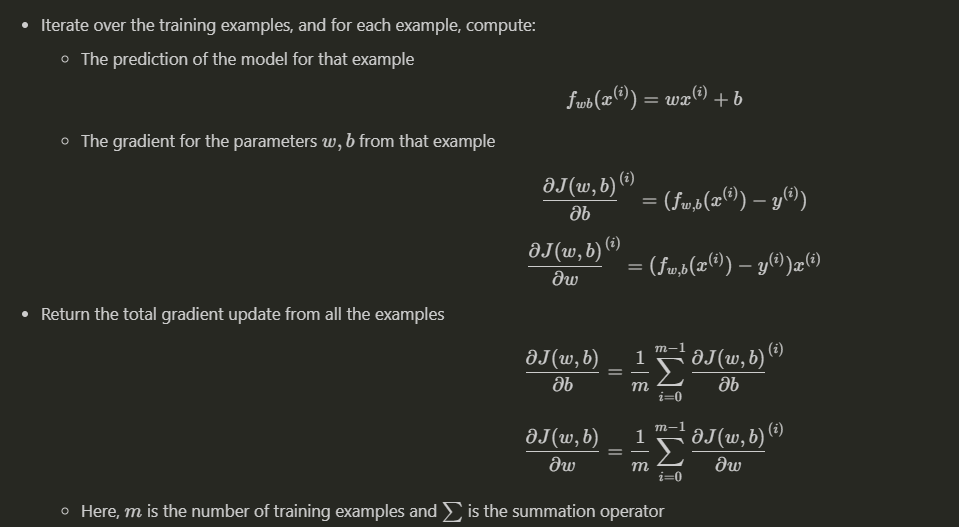
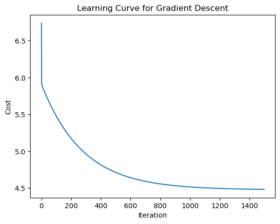
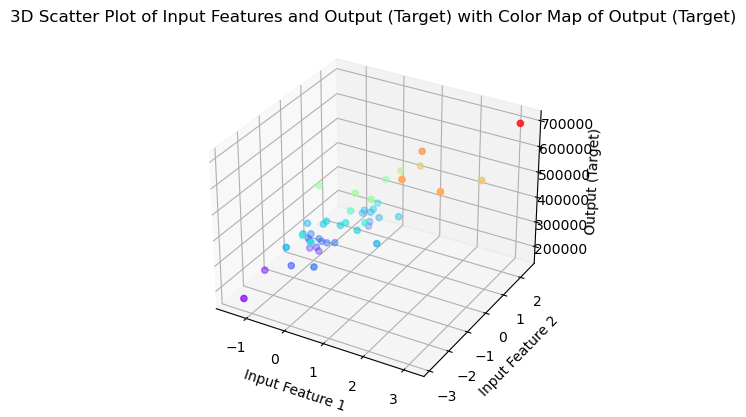

---

# Gradient-Descent-Implementation 🚀  

## Overview 📝  

This project provides a Python implementation of **Gradient Descent** for optimizing **Multiple Linear Regression**. It demonstrates how this optimization algorithm minimizes the **Mean Squared Error (MSE)** cost function to find the best-fitting regression coefficients. The project includes:  
- Visualizations of the **learning curve**  
- A **3D plot** of the cost function  
- Key insights and explanations of fundamental concepts  

---

## Table of Contents 📚  
- [Overview](#overview)  
- [Problem Description](#problem-description)  
- [Gradient Descent](#gradient-descent)  
- [Cost Function (MSE)](#cost-function-mse)  
- [Installation](#installation)  
- [Usage](#usage)  
- [Results and Evaluation](#results-and-evaluation)  
  - [Learning Curve](#learning-curve)  
  - [3D Plot](#3d-plot)  
  - [Explanations of Key Concepts](#explanations-of-key-concepts)  
- [Folder Structure](#folder-structure)  
- [Conclusion](#conclusion)  
- [License](#license)  
- [Acknowledgements](#acknowledgements)  

---

## Problem Description 🔍  

In **Multiple Linear Regression**, the objective is to model the relationship between one dependent variable (target) and multiple independent variables (features). The task involves determining the regression coefficients that minimize the error in predictions.  

The model assumes a linear relationship between the features and the target. Using **Gradient Descent**, the coefficients are optimized iteratively to achieve the best fit, reducing the prediction errors.  

---

## Gradient Descent 🔽  

**Gradient Descent** is an optimization technique that minimizes a cost function by iteratively updating the model’s parameters. The algorithm adjusts the coefficients in small steps, proportional to the negative gradient of the cost function, to move closer to the optimal solution.  

  

### Key Steps:  
1. **Initialize coefficients** with random values or zeros.  
2. **Compute predictions** using the current coefficients.  
3. **Calculate the prediction error** by comparing predictions with actual values.  
4. **Adjust the coefficients** by subtracting a fraction of the gradient from each.  
5. Repeat until the cost function stabilizes or a maximum number of iterations is reached.  

The learning rate controls the size of the step taken at each iteration. Careful tuning of this parameter ensures the algorithm converges effectively.  

---

## Cost Function (MSE) 📉  

The **Mean Squared Error (MSE)** measures the average squared difference between the actual and predicted values. A lower MSE indicates that the model is performing well.  

In this project, **Gradient Descent** iteratively minimizes the MSE to find the optimal regression coefficients, ensuring that the model provides accurate predictions.  

---

## Installation ⚙️  

### Clone the Repository  
```bash  
git clone https://github.com/Bushra-Butt-17/Gradient-Descent-Implementation.git  
cd Gradient-Descent-Implementation  
```  

### Install Dependencies  
```bash  
pip install -r requirements.txt  
```  

---

## Usage 🖥️  

### Option 1: Jupyter Notebooks 📓  
- **`Multiple Linear Regression.ipynb`**: A detailed walkthrough of implementing multiple linear regression using gradient descent.  
- **`Regression_GD.ipynb`**: Another notebook focusing on alternative experiments and explorations.  

### Option 2: Python Script 🧑‍💻  
Run the public tests using:  
```bash  
python utilities_tests/public_tests.py  
```  

### Key Features 🌟:  
- **Model Training**: Implements gradient descent to optimize the regression coefficients.  
- **Visualizations**: Generates:  
  - A **Learning Curve** to track cost reduction over iterations.  
  - A **3D Cost Function Plot** to visualize optimization progress.  

---

## Results and Evaluation 📊  

### Learning Curve 📉  

The learning curve visualizes how the cost function decreases over iterations of Gradient Descent, showing how the algorithm converges effectively.  

  

### 3D Plot 🌐  

The 3D plot provides a graphical representation of the cost function surface for two coefficients. It highlights the path taken by the algorithm as it converges to the optimal solution.  

  

---

## Folder Structure 🗂️  

The project structure is organized as follows:  

```bash  
├── data/                          # Folder for storing datasets  
├── notebooks/                     # Jupyter notebooks for implementations  
│   ├── Multiple Linear Regression.ipynb  
│   ├── Regression_GD.ipynb  
├── utilities_tests/               # Folder for utilities and testing scripts  
│   ├── public_tests.py            # Public test script  
│   ├── utils.py                   # Helper functions for Gradient Descent  
├── requirements.txt               # Dependencies required for the project  
├── LICENSE                        # License information  
└── README.md                      # Project overview and documentation  
```  

---

## Conclusion 🎯  

This project demonstrates how **Gradient Descent** can be effectively used to optimize a **Multiple Linear Regression** model. Through detailed visualizations and explanations, it highlights the algorithm's behavior and convergence process. By iteratively minimizing the **MSE**, the regression coefficients are adjusted to produce accurate predictions.  

---

## License 📜  

This project is licensed under the MIT License. Refer to the [LICENSE](LICENSE) file for more details.  

---

## Acknowledgements 🙏  

Special thanks to the Python community and libraries like **NumPy**, **Matplotlib**, and **Pandas** for enabling efficient computations and visualizations.  

---  


